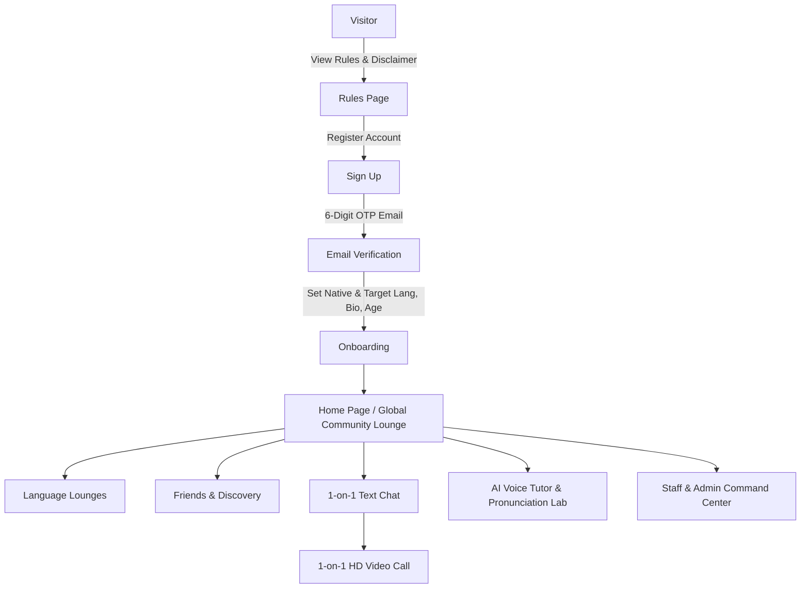
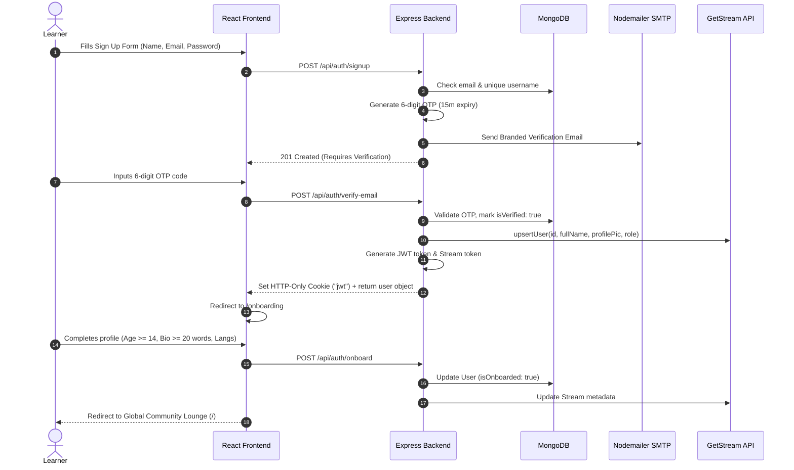
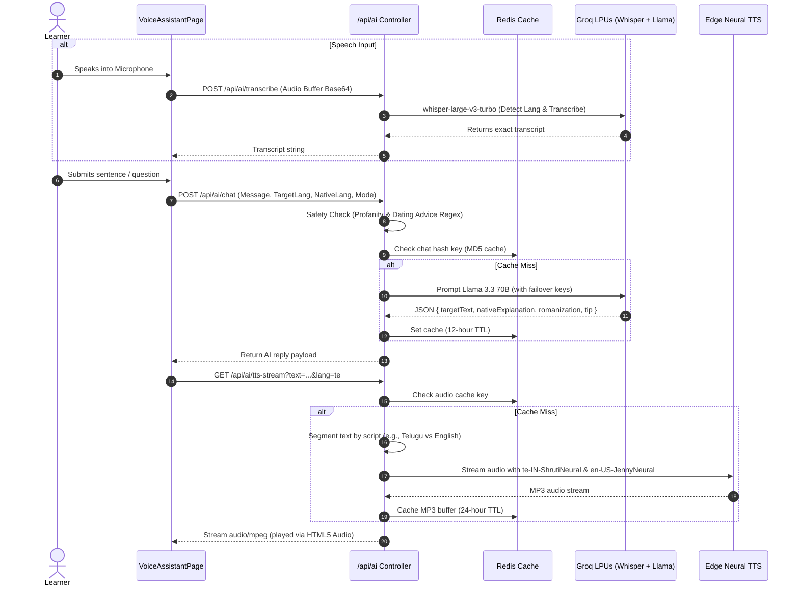
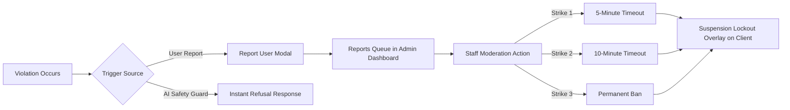

# 🌐 StreamLearn — Real-Time Language Exchange & AI Pronunciation Platform

> **StreamLearn** (also known as **Streamify**) is an enterprise-grade, full-stack language learning and cultural exchange platform. It combines peer-to-peer social networking, real-time multilingual community lounges, WebRTC 1-on-1 HD video calling with tab audio screen sharing, and an AI-powered Voice Tutor and Pronunciation Lab with sub-second neural speech synthesis.

---

## 📑 Table of Contents
1. [Platform Overview & Philosophy](#-platform-overview--philosophy)
2. [Key Features & User Journey](#-key-features--user-journey)
3. [Technology Stack & Architectural Rationale](#-technology-stack--architectural-rationale)
   - [Frontend Architecture](#frontend-architecture)
   - [Backend Architecture](#backend-architecture)
   - [Third-Party Services & APIs](#third-party-services--apis)
4. [Deep-Dive Architecture & Data Flow](#-deep-dive-architecture--data-flow)
   - [End-to-End User Lifecycle](#1-end-to-end-user-lifecycle)
   - [Real-Time Global & Language Lounges](#2-real-time-global--language-lounges)
   - [WebRTC 1-on-1 Video Calling & Screen Sharing](#3-webrtc-1-on-1-video-calling--screen-sharing)
   - [AI Voice Tutor & Pronunciation Lab](#4-ai-voice-tutor--pronunciation-lab)
   - [Trust, Safety & Moderation Pipeline](#5-trust-safety--moderation-pipeline)
5. [Repository Directory Structure](#-repository-directory-structure)
6. [Complete REST API & WebSocket Specification](#-complete-rest-api--websocket-specification)
7. [Environment Configuration Reference](#-environment-configuration-reference)
8. [Installation & Local Development Guide](#-installation--local-development-guide)
9. [Production Deployment & Build Process](#-production-deployment--build-process)
10. [Community Guidelines & Educational Policy](#-community-guidelines--educational-policy)

---

## 🌟 Platform Overview & Philosophy

Learning a foreign language in isolation often leads to grammar knowledge without conversational fluency. Traditional apps rely heavily on text-based flashcards and multiple-choice drills, leaving learners unprepared for spontaneous spoken interaction.

**StreamLearn** bridges this gap through two foundational pillars:
1. **Authentic Human Immersion**: Connects learners with native speakers and language partners across the globe via live language lounges, text chat, and synchronized HD video calling.
2. **AI-Assisted Self-Paced Practice**: Provides a 24/7 private environment where learners can practice speaking, receive instant word-by-word pronunciation scoring, and obtain tongue and mouth placement feedback in their native tongue before speaking with human partners.

### Core Tenets:
- **100% Free & Accessible**: No subscriptions or paywalled tiers. All features (video calls, rooms, AI tutoring) are completely free.
- **Strictly Educational**: Zero tolerance for unsolicited dating, romance queries, harassment, or vulgar language. Built-in instant regex guards and prompt-level filters refuse non-educational queries on the spot.
- **Progressive Discipline**: Automated 3-Strike policy (5-min timeout → 10-min timeout → permanent ban) with staff monitoring and full-screen lockout overlays.
- **Privacy & Age Compliance**: Mandatory 14+ age verification on onboarding, secure 2FA email verification, and HTTP-only JWT session cookies.

---

## 🚀 Key Features & User Journey



### 1. Two-Factor Email Verification & Safe Onboarding
- **6-Digit OTP Verification**: Registration triggers a branded HTML email with a 15-minute expiring numeric code using Nodemailer. Unverified accounts cannot log in or interact.
- **Comprehensive Profile Setup**: Users must supply their native language, target learning language, geographical location, age (enforced 14+), profile avatar, and a meaningful bio (minimum 20 words) to ensure high-quality community interactions.

### 2. Multi-Room Community Lounges (Global Chat)
- **Permanent Global Lounge**: The central hub (`global-community`) where all international members gather.
- **Dynamic Language Lounges**: Dedicated rooms for 21+ languages (Spanish, Hindi, Telugu, Tamil, French, German, Japanese, Korean, Arabic, etc.).
- **Auto-Pruning Inactivity Engine**: User-created or empty language rooms that stay idle for over 30 minutes are automatically deleted from Stream Chat to prevent room clutter.
- **Staff Badges & Name Colors**: High-contrast, deterministic username color coding, with prominent verified badges for platform administrators and appointed sub-administrators.
- **Character Guard**: Real-time client and server limits (300 characters per message) prevent chat flooding and spam.

### 3. Peer Discovery & Social Connection
- **Smart Recommendations**: Recommends global learners based on complementary native and target language pairs.
- **Friend Requests & Notifications**: Real-time incoming and outgoing request system with unread notification badges and instant toast updates.
- **Direct Profiles**: In-depth modal showing language proficiencies, bio, account age, and friendship status.

### 4. 1-on-1 Messaging & Screen-Share Video Calls
- **Synchronized Text Messaging**: Direct 1-on-1 messaging powered by GetStream Chat with typing indicators, reactions, threads, and chat history purging.
- **Low-Latency HD Video Calling**: Powered by Stream Video WebRTC SFU architecture.
- **Audio-Enabled Screen Sharing**: Uses `enableScreenShareAudio()` to stream both video and system/tab audio, allowing partners to share educational videos, podcasts, and presentations together.
- **Full Call Controls**: Camera and microphone toggles, participant grid/speaker layouts, fullscreen mode, and connection health diagnostics.

### 5. AI Voice Assistant & Pronunciation Lab
- **Communication Coach (Voice & Text)**:
  - Real-time conversational AI powered by Groq's high-throughput Llama 3.3 70B Versatile and fast compound models.
  - Multi-script speech synthesis using Microsoft Edge Neural TTS (e.g., `ShrutiNeural` for Telugu, `SwaraNeural` for Hindi, `JennyNeural` for English) with Google TTS fallback.
  - Intelligent script segmentation: detects mixed scripts (e.g., Telugu script + Latin phonetic notes) and switches voices seamlessly within a single sentence.
  - Redis audio caching: audio MP3 buffers and chat turns are cached in Redis (24-hour TTL for audio, 12-hour TTL for chat), providing near-instant audio replay and 0ms cache hits.
  - Live speaking modes: Auto-detect, Speak in Target Language, Speak in Native Language, or mixed bilingual code-switching (Hinglish/Tenglish).
- **Pronunciation Lab**:
  - Word-by-word visual breakdown: **Green** (accurate), **Yellow** (minor accent/hesitation), **Red** (mispronounced or omitted).
  - Concrete articulatory guidance: explains mouth, tongue, and airflow positioning translated directly into the learner's native language.
  - Curated and AI-generated practice sentences across Beginner, Intermediate, and Advanced tiers.

### 6. Staff & Admin Command Center (`/admin`)
- **Real-Time Analytics Dashboard**: Total users, verified users, active strikes, active suspensions, banned accounts, pending reports, and language distribution graphs.
- **Service Health Monitoring**: Live status check for MongoDB, Redis connection, Stream API, and active Groq API key failover pool.
- **User Directory & Moderation**: Search by name or email, filter by violations, issue 5-minute or 10-minute timeouts, clear strikes, force-verify accounts, clear inappropriate profiles, or delete users.
- **Reports Queue**: Process community user reports (harassment, improper webcam behavior, spam, unsolicited dating) with direct resolution actions.
- **Sub-Admin Nomination Workflow**: Head Admin sends a nomination invitation. Candidates must review and accept the official staff agreement via a popup modal before administrative permissions are activated.
- **Global Broadcasts**: Post official creator announcements directly into active lounges.

---

## 🛠 Technology Stack & Architectural Rationale

### Frontend Architecture

| Technology | Purpose in StreamLearn | Why This Tech Was Chosen |
|---|---|---|
| **React 19** | User interface & reactive component hierarchy | Latest concurrent rendering architecture, transitions, and component optimizations for real-time applications. |
| **Vite** | Modern build tool & development server | Sub-millisecond Hot Module Replacement (HMR) and optimized Rollup production bundling, far faster than Webpack. |
| **Tailwind CSS v3** | Atomic styling & design system | Zero-runtime CSS generation, consistent design tokens, effortless responsive classes, and small production bundles. |
| **DaisyUI v4** | UI component primitives & themes | Accessible, styled semantic classes (`btn`, `modal`, `badge`, `card`) with native support for multi-theme switching (`data-theme`). |
| **React Router v7 / v8** | Client-side routing & navigation | Declarative nested routing, protected route guards, redirects, and state preservation across transitions. |
| **TanStack React Query v5** | Server-state management & caching | Automatic cache invalidation, deduplication of concurrent requests, background synchronization, and optimistic UI updates for friend requests and moderation actions. |
| **Zustand** | Lightweight client-state management | Minimal boilerplate store for themes, sidebar toggle states, and global user profile modals without the overhead of Redux. |
| **Stream Video React SDK** | WebRTC video & audio engine | Enterprise-grade SFU (Selective Forwarding Unit) architecture, automatic bandwidth adaptation, screen share audio, and cross-browser reliability. |
| **Stream Chat React SDK** | Real-time chat UI & events | Battle-tested chat components with built-in typing indicators, optimistic message sending, unread badges, and reconnection handling. |
| **Lucide React** | Scalable vector icons | Clean, modern, lightweight SVG icons with tree-shaking support. |
| **React Hot Toast** | Floating notification alerts | Lightweight, non-blocking visual feedback for network events, errors, and approvals. |

### Backend Architecture

| Technology | Purpose in StreamLearn | Why This Tech Was Chosen |
|---|---|---|
| **Node.js (ES Modules)** | Asynchronous server runtime | High-throughput non-blocking I/O ideal for handling concurrent REST requests and WebSocket streams. Native ESM syntax (`import`/`export`). |
| **Express 4.21** | RESTful HTTP API framework | Robust, unopinionated routing, middleware chaining, and battle-tested HTTP handling. |
| **MongoDB & Mongoose 8** | Primary database & object modeling | Flexible schema design for user profiles, friendship arrays, reports queue, and sub-admin invitation states. Excellent aggregation pipeline for admin analytics. |
| **Redis & `ioredis` 6** | High-performance cache & rate limiter | Sub-millisecond in-memory storage for AI responses, TTS audio binary caching, and sliding-window rate limiting. Implements graceful fallback if Redis is offline. |
| **WebSockets (`ws` 8)** | Bidirectional streaming for AI voice | Low-latency full-duplex communication channel between browser and server for live voice turns. |
| **Groq Cloud API (`openai` SDK)** | Ultra-fast LLM & Whisper inference | LPUs (Language Processing Units) deliver sub-second response times for Llama 3.3 70B and `whisper-large-v3-turbo` audio transcription, critical for conversational AI. |
| **Microsoft Edge TTS (`msedge-tts`)** | Neural multilingual speech synthesis | Studio-quality human-like voices across 21+ languages (including regional Indian languages like Telugu, Hindi, Tamil, Kannada) with zero cost compared to commercial cloud TTS. |
| **Nodemailer** | SMTP email transport | Automated delivery of responsive HTML two-factor verification emails via Gmail or custom SMTP hosts. |
| **JWT & `bcryptjs`** | Authentication & password hashing | Industry-standard stateless authentication stored in secure HTTP-only cookies; salted bcrypt hashing (10 rounds) protects passwords against rainbow table attacks. |

---

## 🔍 Deep-Dive Architecture & Data Flow

### 1. End-to-End User Lifecycle



### 2. Real-Time Global & Language Lounges
- All connected clients join Stream Chat livestream channels (`livestream:global-community` or `livestream:lang-<name>`).
- When a user selects a language from the lounge selector:
  1. Frontend creates or queries the channel with channel ID `lang-<normalized_language>`.
  2. The lounge list renders participant counters, last message timestamps, and active badges.
  3. If no messages are posted in a custom lounge for **30 minutes**, the backend marks it as inactive and broadcasts a `room_removed` event via the main channel, causing all clients to refresh their room list cleanly.

### 3. WebRTC 1-on-1 Video Calling & Screen Sharing
- When user A calls user B:
  1. Frontend navigates to `/call/:id` where `:id` is a deterministic channel identifier (e.g., `userA-userB` or a unique call room ID).
  2. Frontend queries `GET /api/chat/token` to acquire a cryptographically signed HMAC token from the backend using the Stream Secret Key.
  3. The `StreamVideoClient` establishes a WebRTC connection with Stream's SFU edge network.
  4. Auto-enables local media devices (webcam & microphone) upon joining.
  5. `enableScreenShareAudio()` is invoked so when a user shares their screen or browser tab, the audio track is mixed and broadcasted simultaneously.

### 4. AI Voice Tutor & Pronunciation Lab



#### Multi-Key Groq Failover Engine
Located in `backend/src/services/groqService.js`:
- Scans `process.env` dynamically for all keys containing `GROQ` (e.g. `GROQ_API_KEY_1`, `GROQ_API_KEY_2`, etc.).
- Rotates keys round-robin. If one key encounters a rate limit (HTTP 429) or temporary network failure, it automatically shifts to the next available key without interrupting the user's conversation.

#### Multi-Script Edge TTS Engine
Located in `backend/src/controllers/ai.controller.js`:
- Recognizes that language tutors often speak both the target foreign language and the user's native tongue in a single explanation.
- Uses script detection regexes (`[\u0C00-\u0C7F]` for Telugu, `[\u0900-\u097F]` for Devanagari, `[\u3040-\u30FF]` for Japanese, etc.).
- Segments the sentence into distinct phonetic chunks and synthesizes each chunk with its native neural voice before concatenating the audio buffers into a single MP3 stream.

### 5. Trust, Safety & Moderation Pipeline



- **Instant Automated Filters**:
  - **Profanity / Unparliamentary Language**: Intercepts abusive terminology across English, Hindi, Telugu, Tamil, Kannada, Malayalam, and Spanish. The AI refuses politely and offers a "Decorum Tip".
  - **Dating & Romance Guard**: Catches dating queries, pickup line requests, and romantic solicitation in multiple languages and dialects. The AI explicitly redirects focus to vocabulary and practical conversation.
- **Progressive Discipline (3-Strike Rule)**:
  - **Strike 1**: 5-minute cooldown period. Account is temporarily blocked from chat, calls, and rooms.
  - **Strike 2**: 10-minute cooldown period for repeated infractions.
  - **Strike 3**: Permanent ban. Account is indefinitely blocked from logging in or using features.
- **Client Suspension Lockout Overlay**:
  - A persistent, full-screen reactive component (`SuspensionLockoutOverlay.jsx`) checks `suspendedUntil` and `isBanned` timestamps and prevents suspended users from accessing navigation or interactive controls.

---

## 📁 Repository Directory Structure

```
streamlearn/
├── package.json                   # Root monorepo build & orchestration script
├── backend/                       # Express, MongoDB, Redis & AI backend
│   ├── .env                       # Backend environment configuration
│   ├── package.json               # Backend dependencies & npm scripts
│   └── src/
│       ├── server.js              # Application entry point, HTTP & WebSocket server
│       ├── controllers/
│       │   ├── admin.controller.js   # Analytics, user directory, rooms, broadcasts
│       │   ├── ai.controller.js      # Groq chat, pronunciation evaluation, Whisper, TTS
│       │   ├── auth.controller.js    # Signup, 2FA verify email, login, onboarding
│       │   ├── chat.controller.js    # Stream tokens, direct chat channel creation
│       │   ├── report.controller.js  # User reports creation & retrieval
│       │   └── user.controller.js    # Friends list, recommendations, profiles, sub-admins
│       ├── lib/
│       │   ├── db.js                 # MongoDB connection handler
│       │   ├── email.js              # Nodemailer HTML template & SMTP transport
│       │   ├── redis.js              # ioredis connection, cache helpers & fallbacks
│       │   ├── stream.js             # Stream Chat & Video client instantiation & user sync
│       │   └── wsHandler.js          # WebSocket server for real-time AI tutor
│       ├── middleware/
│       │   ├── admin.middleware.js   # Staff (Admin / Sub-Admin / Creator) access guard
│       │   ├── auth.middleware.js    # JWT verification & user state loader
│       │   └── rateLimiter.js        # Redis sliding-window request limiter
│       ├── models/
│       │   ├── FriendRequest.js      # Friend requests schema (sender, recipient, status)
│       │   ├── Report.js             # Abuse reports schema (reasons, context, resolution)
│       │   └── User.js               # User schema (roles, strikes, suspensions, flags)
│       ├── routes/
│       │   ├── admin.route.js        # /api/admin endpoints
│       │   ├── ai.route.js           # /api/ai endpoints
│       │   ├── auth.route.js         # /api/auth endpoints
│       │   ├── chat.route.js         # /api/chat endpoints
│       │   ├── report.route.js       # /api/reports endpoints
│       │   └── user.route.js         # /api/users endpoints
│       └── services/
│           └── groqService.js        # Multi-key Groq manager, Whisper, Llama prompt engineer
└── frontend/                      # React 19 + Vite client
    ├── index.html                 # HTML entry point with metadata & viewport
    ├── package.json               # Frontend dependencies & scripts
    ├── tailwind.config.js         # Tailwind & DaisyUI theme settings
    ├── vite.config.js             # Vite configuration with API reverse proxy
    └── src/
        ├── App.jsx                # Route declarations & global overlay providers
        ├── main.jsx               # React DOM root mounting with QueryClientProvider
        ├── index.css              # Global styles, scrollbars & animation utilities
        ├── components/
        │   ├── CallButton.jsx               # Quick 1-on-1 video call trigger
        │   ├── ChatLoader.jsx               # Skeleton loading placeholder for chats
        │   ├── FriendCard.jsx               # Friend card with avatar, flag & actions
        │   ├── GlobalChat.jsx               # Multi-room language lounges component
        │   ├── Layout.jsx                   # Primary layout wrapper with Navbar & Sidebar
        │   ├── Navbar.jsx                   # Navigation bar with user status & theme picker
        │   ├── NoFriendsFound.jsx           # Empty state illustration for friends
        │   ├── NoNotificationsFound.jsx     # Empty state illustration for notifications
        │   ├── PageLoader.jsx               # Full-page loading spinner
        │   ├── ReportUserModal.jsx          # Contextual reporting modal
        │   ├── Sidebar.jsx                  # Quick navigation drawer with unread badges
        │   ├── SubAdminInvitationModal.jsx  # Staff nomination acceptance modal
        │   ├── SuspensionLockoutOverlay.jsx # Fullscreen modal for suspended/banned users
        │   ├── ThemeSelector.jsx            # DaisyUI theme switcher (20+ themes)
        │   └── UserProfileModal.jsx         # Detailed user profile inspector modal
        ├── constants/
        │   └── index.js           # Supported languages, flag emojis, themes
        ├── context/
        │   └── StreamChatContext.jsx # Global GetStream chat client provider & unread tracker
        ├── hooks/
        │   ├── useAuthUser.js          # Current user query hook
        │   ├── useLogin.js             # Login mutation hook
        │   ├── useLogout.js            # Logout mutation hook
        │   ├── useNotificationCount.js # Unread friend request & notification counter
        │   ├── useSignUp.js            # Registration mutation hook
        │   └── useVerifyEmail.js       # 2FA code verification mutation hook
        ├── lib/
        │   ├── api.js             # Axios client wrappers for all backend endpoints
        │   ├── axios.js           # Configured Axios instance with credentials
        │   └── utils.js           # String formatters, name styles, capitalization
        ├── pages/
        │   ├── AdminPage.jsx            # Staff Command Center (Users, Reports, Rooms, Stats)
        │   ├── CallPage.jsx             # WebRTC 1-on-1 video calling & screen sharing
        │   ├── ChatPage.jsx             # 1-on-1 direct messaging window
        │   ├── FriendsPage.jsx          # Friends list & global learner discovery
        │   ├── HomePage.jsx             # Global Community Chat dashboard
        │   ├── LoginPage.jsx            # Sign in with email & password
        │   ├── NotificationsPage.jsx    # Incoming/outgoing requests & notifications
        │   ├── OnboardingPage.jsx       # Profile setup (languages, location, bio, age)
        │   ├── RulesPage.jsx            # Interactive Community Guidelines & Disclaimer
        │   ├── SignUpPage.jsx           # Registration with email OTP verification
        │   └── VoiceAssistantPage.jsx   # AI Communication Coach & Pronunciation Lab
        └── store/
            ├── useProfileModalStore.js  # Global modal state for user profile previews
            ├── useSidebarStore.js       # Responsive sidebar open/close state
            └── useThemeStore.js         # Active theme state persisted to localStorage
```

---

## 📡 Complete REST API & WebSocket Specification

### 1. Authentication Endpoints (`/api/auth`)
| Method | Path | Auth Required | Description |
|---|---|---|---|
| `POST` | `/api/auth/signup` | No | Register new account. Generates and emails 6-digit OTP code. |
| `POST` | `/api/auth/verify-email` | No | Verifies 6-digit OTP. Sets HTTP-only JWT cookie upon success. |
| `POST` | `/api/auth/resend-code` | No | Re-generates and re-sends OTP code to the provided email. |
| `POST` | `/api/auth/login` | No | Validates credentials, checks verification status, sets JWT cookie. |
| `POST` | `/api/auth/logout` | Yes | Clears HTTP-only JWT cookie. |
| `GET` | `/api/auth/me` | Yes | Returns current authenticated user record. |
| `POST` | `/api/auth/onboard` | Yes | Completes initial user setup (requires age >= 14, bio >= 20 words). |

### 2. User & Social Endpoints (`/api/users`)
| Method | Path | Auth Required | Description |
|---|---|---|---|
| `GET` | `/api/users/recommended` | Yes | Fetches recommended users based on language compatibility. |
| `GET` | `/api/users/all` | Yes | Retrieves list of all onboarded global learners. |
| `GET` | `/api/users/friends` | Yes | Returns the authenticated user's confirmed friends. |
| `GET` | `/api/users/friend-requests` | Yes | Returns incoming pending requests and accepted notifications. |
| `GET` | `/api/users/outgoing-requests` | Yes | Returns pending outgoing friend requests sent by the user. |
| `POST` | `/api/users/friend-request/:id` | Yes | Sends a new friend request to target user. |
| `PUT` | `/api/users/friend-request/:id/accept` | Yes | Accepts an incoming friend request. |
| `PUT` | `/api/users/friend-request/:id/reject` | Yes | Declines and deletes an incoming friend request. |
| `DELETE` | `/api/users/notification/:id` | Yes | Dismisses a specific notification item. |
| `DELETE` | `/api/users/notifications/clear` | Yes | Clears all accepted notification entries. |
| `DELETE` | `/api/users/unfriend/:id` | Yes | Removes friendship and deletes chat relations between two users. |
| `GET` | `/api/users/profile/:id` | Yes | Retrieves detailed profile information for a given user. |
| `PUT` | `/api/users/profile` | Yes | Updates profile fields (name, bio, languages, location, avatar). |
| `POST` | `/api/users/staff-invitation/respond` | Yes | Accepts or declines a Sub-Admin nomination invitation. |

### 3. Real-Time Chat & Video Endpoints (`/api/chat`)
| Method | Path | Auth Required | Description |
|---|---|---|---|
| `GET` | `/api/chat/token` | Yes | Generates a signed GetStream HMAC user token for chat and video. |
| `POST` | `/api/chat/channel/:targetUserId` | Yes | Creates or retrieves a 1-on-1 direct messaging channel with target user. |
| `DELETE` | `/api/chat/channel/:targetUserId/history` | Yes | Truncates and clears all message history in a 1-on-1 channel. |

### 4. AI Voice Tutor & Pronunciation Endpoints (`/api/ai`)
| Method | Path | Auth Required | Description |
|---|---|---|---|
| `POST` | `/api/ai/chat` | Yes | Sends message turn to Groq Llama 3.3. Returns structured target/native text. |
| `POST` | `/api/ai/transcribe` | Yes | Transcribes base64 audio via Groq Whisper (`whisper-large-v3-turbo`). |
| `POST` | `/api/ai/check-pronunciation` | Yes | Word-by-word pronunciation scoring with tongue/mouth placement suggestions. |
| `POST` | `/api/ai/practice-sentence` | Yes | Generates beginner, intermediate, or advanced conversational sentences. |
| `POST` | `/api/ai/translate` | Yes | Translates input text directly into the specified target language. |
| `GET` | `/api/ai/tts-stream` | Yes | Streams multi-script Edge Neural TTS MP3 audio with Redis caching. |
| `GET` | `/api/ai/key-status` | Yes | Returns active Groq API engine status and healthy key count. |

### 5. Staff & Admin Endpoints (`/api/admin`)
| Method | Path | Auth Required | Role | Description |
|---|---|---|---|---|
| `GET` | `/api/admin/stats` | Yes | Staff | Aggregated platform metrics and live service health. |
| `GET` | `/api/admin/users` | Yes | Staff | Searchable, paginated user directory with violation filters. |
| `POST` | `/api/admin/moderation` | Yes | Staff | Applies timeouts, permanent bans, strike resets, or profile wipes. |
| `DELETE` | `/api/admin/users/:userId` | Yes | Admin | Permanently deletes user account and removes them from Stream. |
| `PUT` | `/api/admin/users/:userId/role` | Yes | Admin | Promotes user to Sub-Admin (sends invite) or Admin. |
| `GET` | `/api/admin/reports` | Yes | Staff | Fetches pending or resolved community abuse reports. |
| `PUT` | `/api/admin/reports/:reportId` | Yes | Staff | Resolves or dismisses an abuse report. |
| `POST` | `/api/admin/broadcast` | Yes | Admin | Broadcasts creator announcement to Global Community Lounge. |
| `GET` | `/api/admin/rooms` | Yes | Staff | Lists active language rooms with inactivity timestamps. |
| `DELETE` | `/api/admin/rooms/:roomId` | Yes | Staff | Force closes and deletes a community chat room. |

### 6. User Reports Endpoints (`/api/reports`)
| Method | Path | Auth Required | Description |
|---|---|---|---|
| `POST` | `/api/reports` | Yes | Submits a report against another user with violation category and context. |

### 7. Live AI WebSocket Stream (`/ws/live-tutor`)
- **Protocol**: `ws://` (development) or `wss://` (production)
- **Path**: `/ws/live-tutor`
- **Supported Payload Types**:
  - `ping` ➔ Responds with `{ type: "pong" }`
  - `chat_turn` ➔ Receives `{ message, targetLanguage, level, scenario, history }`, emits `{ type: "thinking" }`, followed by `{ type: "ai_response", data: { ... } }`

---

## ⚙️ Environment Configuration Reference

### Backend Configuration (`backend/.env`)

```env
# Server Port & Mode
PORT=5000
NODE_ENV=development

# Database Connection
MONGO_URI=mongodb://localhost:27017/streamlearn
# OR Mongo Atlas:
# MONGO_URI=mongodb+srv://<user>:<password>@cluster.mongodb.net/streamlearn?retryWrites=true&w=majority

# In-Memory Cache (Redis)
# Leave as default or leave empty to automatically run in graceful offline fallback
REDIS_URL=redis://localhost:6379

# Authentication (JWT)
JWT_SECRET=your_super_secret_jwt_key_here_min_32_chars

# GetStream Credentials (https://getstream.io)
STREAM_API_KEY=your_stream_api_key
STREAM_API_SECRET=your_stream_api_secret

# Email Verification (Nodemailer SMTP)
EMAIL_SERVICE=gmail
EMAIL_USER=your_email@gmail.com
EMAIL_PASS=your_gmail_app_specific_password

# Groq Cloud API Keys (https://console.groq.com/keys)
# Support for multiple keys with automatic failover & load rotation
GROQ_API_KEY_1=gsk_your_primary_groq_api_key
GROQ_API_KEY_2=gsk_your_backup_groq_api_key_optional
```

### Frontend Configuration (`frontend/.env`)

```env
# GetStream Public Client Key (Same as backend STREAM_API_KEY)
VITE_STREAM_API_KEY=your_stream_api_key
```

---

## 💻 Installation & Local Development Guide

### Prerequisites
- **Node.js**: Version 18.18.0 or higher (supports native Fetch, FormData, and ESM).
- **npm**: Version 9.0.0 or higher.
- **MongoDB**: A running local MongoDB instance (`mongod`) or a free MongoDB Atlas cluster URI.
- **Redis (Optional)**: A running local Redis instance (`redis-server`). If not present, the server automatically boots in direct memory mode without crashing.
- **GetStream Account**: Free account at [getstream.io](https://getstream.io) to obtain your API Key and Secret.
- **Groq Cloud Account**: Free API key at [console.groq.com](https://console.groq.com).

### Step-by-Step Setup

#### 1. Clone Repository & Install Dependencies
```bash
git clone https://github.com/Umeshh27/streamlearn.git
cd streamlearn

# Install root, backend, and frontend dependencies
npm run build
```
*(Or install manually in each subfolder)*:
```bash
cd backend && npm install
cd ../frontend && npm install
cd ..
```

#### 2. Configure Environment Variables
Create the `.env` files in both `backend` and `frontend` directories using the reference values outlined in the [Environment Configuration Reference](#-environment-configuration-reference) section:
- `backend/.env`
- `frontend/.env`

#### 3. Start Development Servers

You can run both backend and frontend concurrently in two separate terminal windows:

**Terminal 1 (Backend API & WebSocket Server):**
```bash
cd backend
npm run dev
```
*The backend server will start on `http://localhost:5000`.*

**Terminal 2 (Vite Frontend Development Server):**
```bash
cd frontend
npm run dev
```
*Vite will start on `http://localhost:5173` with automatic API proxying to `localhost:5000`.*

Open your browser at `http://localhost:5173`.

---

## 📦 Production Deployment & Build Process

The project is structured with a root orchestration script that builds both tiers into a unified production distribution:

```bash
# 1. Build frontend bundle and install production dependencies
npm run build

# 2. Launch production Node.js server
npm start
```

### Static Asset Serving Architecture
In production mode (`NODE_ENV=production`), `backend/src/server.js` automatically locates the compiled frontend build files from `frontend/dist/` and serves them as static assets:
```javascript
// backend/src/server.js
const possibleDistPaths = [
  path.resolve(currentDir, "../../frontend/dist"),
  path.resolve(process.cwd(), "frontend/dist"),
  path.resolve(process.cwd(), "../frontend/dist"),
];
const distPath = possibleDistPaths.find((p) => fs.existsSync(p));

if (distPath || process.env.NODE_ENV === "production") {
  app.use(express.static(finalDist));
  app.get("*", (req, res, next) => {
    if (req.path.startsWith("/api") || req.path.startsWith("/ws")) return next();
    res.sendFile(path.join(finalDist, "index.html"));
  });
}
```
This enables single-container or single-server deployment (e.g. Render, Railway, AWS EC2, DigitalOcean App Platform) without requiring a separate static host.

---

## 🛡 Community Guidelines & Educational Policy

StreamLearn exists solely for educational language learning and intercultural communication. All users agree to abide by the following standards upon entering:

1. **Age Requirement**: Users must be **at least 14 years old** to register or participate.
2. **Zero Tolerance for Unsolicited Dating & Romance**:
   - StreamLearn is not a dating app. Unsolicited romantic propositions, flirtatious comments, asking for phone numbers/social media handles for dating purposes, or using the AI coach for pickup lines is strictly prohibited.
3. **Appropriate Webcam & Video Call Etiquette**:
   - Users in video calls must maintain appropriate attire and posture. Indecent exposure, lewd gestures, or offensive background imagery results in an immediate permanent ban.
4. **Parliamentary Language Only**:
   - Hate speech, slurs, profanity, harassment, and cyberbullying are strictly filtered by automated safety guards and community moderators.
5. **The 3-Strike Disciplinary System**:
   - **Strike 1 (Warning & 5-Min Cooldown)**: Temporary timeout for minor spam or guideline infractions.
   - **Strike 2 (Final Warning & 10-Min Cooldown)**: Extended timeout for repeated violations.
   - **Strike 3 (Permanent Ban)**: Permanent revocation of access across all services.

---

## 👥 Contributors & Acknowledgements
- **Lead Creator & Administrator**: Umesh Alla ([umeshalla73@gmail.com](mailto:umeshalla73@gmail.com))
- **Video & Real-Time Engine**: [GetStream.io](https://getstream.io)
- **High-Speed Inference**: [Groq Cloud](https://groq.com)
- **Neural Speech Synthesis**: Microsoft Edge Neural TTS

---
*Built with passion to bring language learners together worldwide.* 🌍✨
